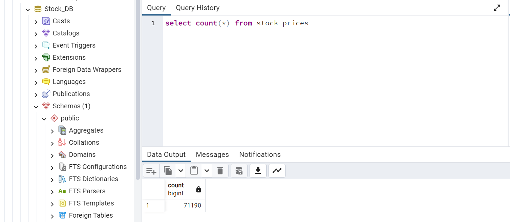

# Stock Price Analysis
 **(Project 3)**  
  **Data and Delivery**  
  &nbsp;&nbsp; As our project is to analyze stock price data, we use data from Yahoo Finance stored in a Postgres DB hosted on
Neon.tech cloud service. The data is served to the front-end dashboard via a
Flask API. The front end uses the Plotly library to plot the graphs, which
converts the data into Plotly traces. Each stock contains at least 1,000
records, and with a total of ten stocks loaded, we have more than 70,000
records.  
<figure>
  
  <figcaption>Total number of records: 71,190</figcaption>
</figure>
 &nbsp;&nbsp;  The Postgres DB is accessed via a Flask app, which serves the data to the frontend
as JSON format through Flask APIs. The frontend dashboard makes use of HTML/CSS
and JS.  
<figcaption>Total number of records 71,900</figcaption> 
**Front End**   
 &nbsp;&nbsp; The chosen design is a dashboard page with multiple charts that all reference the
same data. Besides Plotly.js, we also make use of Bootstrap.js which is not
covered in class, to simplify formatting of the dashboard.
 
**Visualizations**  
&nbsp;&nbsp;  Our dashboard includes four main views: the price chart, the
candlestick chart, the volume chart (Stock Info tab) and the comparison chart
as well as the stock info table.
We make use of tabs to separate the
functionalities of our dashboard, dropdown box to select a stock, menu to
select multiple stocks, date filters, update button, as well as the
interactivity of Plotly charts such as scroll-zoom and panning.  
 &nbsp;&nbsp; The dashboard is intuitive in its design: in
Stock Info tab, a user can quickly select a stock and view the stock
information, as well as select multiple stocks to compare them in Compare Stocks tab.  
<figure>
  
  <figcaption>First tab: Stock Info tab </figcaption>
</figure>  

 <figure>
   
 <figcaption>Second tab: Compare Stock tab </figcaption>  
</figure>
  
  &nbsp;&nbsp; The dashboard shows the stock data from
different perspectives: the stock info table gives some fundamental analysis
info about the stock, the price chart gives a high-level view of the stock
performance, while the candlestick chart provides a deeper level of
understanding of the stock performance. The user can filter by the period they
are interested in seeing it in more detail. The second tab allows users to
compare the performances of different stocks in one convenient chart.

 **Running the dashboard**  
   The database is hosted in Neon.tech.
   <ol>
   <li>In a command line terminal, cd into the project folder</li>
   <li>To connect to the database run</li>
   >python app.py
    <pre>Open the browser with the url: "localhost:<i>port</i>"</pre>
   <li>In another command line terminal, cd into the project folderTo run the dashboard </li>
   >python -m http.server
   <li>If you run into CORS issue (dashboard doesn't work), you need to install express.js and run the below command </li>
   >node server.js
    <pre>Open the browser with the url: "localhost:<i>port</i>"</pre>
  </ol>
